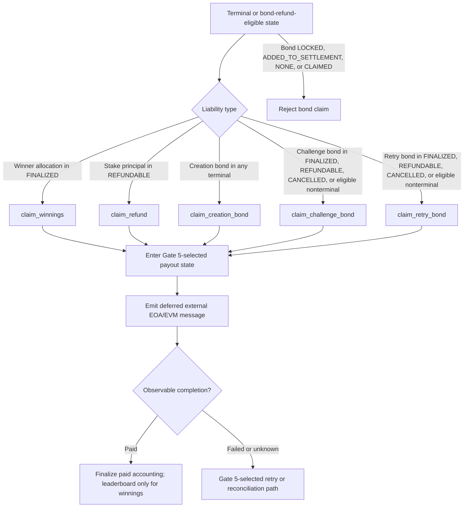

# TruthMarket V4 state machine

Status: **proposed, unimplemented, and undeployed**. This document is normative with the [architecture](V4_ARCHITECTURE.md) and uses its closed enums, timing symbols, bond rules, and exact cancellation predicates. See also [economics and safety](V4_ECONOMICS_AND_SAFETY.md), [migration](V4_MIGRATION_PLAN.md), and [tests](V4_TEST_PLAN.md).

## 1. State representation

Stored `MarketPhase` is `OPEN`, `EVIDENCE_CLOSED`, `RESOLUTION_REQUESTED`, `PROVISIONALLY_RESOLVED`, `RERESOLUTION_REQUESTED`, `FINALIZED`, `REFUNDABLE`, or `CANCELLED`. Authorization MUST use stored phase plus orthogonal fields, never a UI label.

The non-claim `ActivityKind` set is closed. The current complete candidate is `MARKET_CREATED | STAKE_ADDED | EVIDENCE_SUBMITTED | EVIDENCE_CLOSED | ATTEMPT_REQUESTED | ATTEMPT_SUCCEEDED | ATTEMPT_FAILED | ATTEMPT_EXPIRED | CHALLENGE_SUBMITTED | MARKET_FINALIZED | MARKET_CANCELLED | WINNINGS_CLAIMED | STAKE_REFUND_CLAIMED | CREATION_BOND_CLAIMED | CHALLENGE_BOND_CLAIMED | RETRY_BOND_CLAIMED`; its five claim kinds and their branch timing remain conditional on Gate 5 and require amendment if the selected payout model needs distinct request, failure, completion, or reconciliation records.

All protocol record identities are one-based and zero is invalid. The first market is `MarketId=1`; a successful creation allocates `market_id=pre-write market_count+1`, then sets `market_count=market_id`, so valid markets are exactly `1..market_count`. Attempts are market-local and share one sequence across `INITIAL` and `RERESOLUTION`: `attempt_no=pre-write (initial_attempt_count+reresolution_attempt_count)+1`, beginning with `1`. Evidence, challenge, and activity similarly allocate their pre-write count plus one. Only a committed write consumes an ID; rejection, revert, or transaction failure consumes none. Claim-side ID/activity consumption on deferred payout failure is selected by Gate 5 and MUST preserve consecutiveness without assuming synchronous rollback. First-kind predecessor references are `null`, retries use an exact non-null one-based number, and nullable references never use numeric zero. The participant array index remains zero-based and is distinct from these IDs.

Each attempt stores `stored_status`. Views compute the exact function:

```text
effective_status(attempt, now) =
    EXPIRED
        if attempt.stored_status == REQUESTED
        and now >= attempt.execute_by
    otherwise attempt.stored_status
```

The complete truth table is:

| Stored status | Time condition | Effective status | `expiry_materialized` |
| --- | --- | --- | --- |
| `REQUESTED` | `now<execute_by` | `REQUESTED` | `false` |
| `REQUESTED` | `now>=execute_by` | `EXPIRED` | `false` |
| `SUCCEEDED` | any | `SUCCEEDED` | `false` |
| `FAILED` | any | `FAILED` | `false` |
| `EXPIRED` | any | `EXPIRED` | `true` |

Thus `expiry_materialized := (stored_status == EXPIRED)`. `active_attempt_no` is derived, never stored: it is null or the unique latest applicable attempt with `effective_status=REQUESTED`, `now<execute_by`, and a nonterminal market. At time-derived expiry, the derived number becomes null before materialization. `expire_attempt` changes stored `REQUESTED` to `EXPIRED`; `retry_resolution` may do so atomically before appending its successor. Success, catchable failure, or terminalization also makes the derived field null, but terminalization does not rewrite historical attempt status. A failed/expired predecessor is explicitly referenced and never active.

Derived booleans are independent:

- `challenge_window_open := phase=PROVISIONALLY_RESOLVED AND accepted kind=INITIAL AND start<=now<end`.
- `challenge_pending := challenge_count>0 AND no RERESOLUTION succeeded AND nonterminal`.
- `has_active_attempt := active_attempt_no!=null` with the unique eligible `REQUESTED` record.
- `cancellation_eligible := nonterminal AND some authorized caller can exercise the highest-precedence true cancellation predicate`.
- `permissionless_cancellation_eligible := nonterminal AND the highest-precedence reason is HARD_BACKSTOP, INITIAL_ATTEMPTS_EXHAUSTED, RERESOLUTION_ATTEMPTS_EXHAUSTED, INITIAL_REQUEST_DEADLINE_MISSED, or RERESOLUTION_REQUEST_DEADLINE_MISSED`.
- `creator_cancellation_eligible := nonterminal AND EMPTY_CREATOR_CANCEL is the highest-precedence true reason`.
- `ready_to_finalize := all finalization guards are true`.
- market-wide `claimable := (settlement.claims_open_at!=null AND now>=settlement.claims_open_at AND ((settlement.mode=WINNERS AND settlement.paid_out_wei<settlement.distributable_wei) OR (settlement.mode=REFUNDS AND settlement.refunded_stake_wei<settlement.refundable_stake_wei))) OR refundable_bond_liability_wei>0`; this includes nonterminal bond claims, while address-specific amounts come only from `get_claimable(market_id,user)`.

Display-only `effective_phase` uses first-match precedence: stored terminal; `CANCELLATION_ELIGIBLE`; `RERESOLUTION_REQUESTED`; `CHALLENGE_PENDING`; `CHALLENGE_WINDOW`; `PROVISIONALLY_RESOLVED`; `RESOLUTION_REQUESTED`; `EVIDENCE_CLOSED`; `OPEN`. It MUST NOT authorize a write.

`get_cancellation_eligibility(market_id,caller)` returns the closed `CancellationEligibilityView` defined in the [read ABI](V4_ARCHITECTURE.md#32-closed-bounded-read-abi); a viewer cannot infer permission from market-wide eligibility alone.

## 2. Complete transition table

`Timestamp=uint64`; runtime contract time and every calculated timestamp MUST convert and fit exactly. `U`, `AI`, `C`, `G`, `AR`, and `F` have the exact meanings in [architecture timing](V4_ARCHITECTURE.md#5-timing-and-cancellation). Exactly creation, stake, challenge, and retry receive value; every other action requires zero. “Reject” means no committed mutation, activity record, or transfer.

Creation captures one `t_create` at method entry, stores `created_at=t_create` on commit, and uses that same value for all checks. Its absolute cutoff guard is exactly the checked inclusive inequality `t_create+min_market_duration <= stake_cutoff_at <= t_create+max_market_duration`. It then derives `evidence_cutoff_at=stake_cutoff_at`, `U=stake_cutoff_at+fund_unlock_delay`, and `initial_request_deadline_at=U-(AI+C+G+AR+F)`, rejecting before value or IDs unless every `uint64` operation fits and the initial deadline is at least the evidence cutoff.

| Current stored phase | Action | Actor | Required time | Guards | Next phase | Financial effect | Failure behavior |
| --- | --- | --- | --- | --- | --- | --- | --- |
| none | `create_market` | anyone | captured `t_create`; checked inclusive `t_create+min_market_duration <= stake_cutoff_at <= t_create+max_market_duration` | exact processed bounded text/config, all derived `uint64` checks, market cap; exact creation bond | `OPEN` | allocates next one-based market/activity IDs only on commit and receives one `LOCKED` creation bond | reject before value, IDs, counts, or state |
| `OPEN` | `stake` | anyone | `now<stake_cutoff_at` | valid side/value; stake-call cap; participant cap only if unindexed | `OPEN` | first positive stake atomically appends/maps one participant and creates position; every stake reconciles side/total pools | reject before value/index/position/pool/activity mutation |
| `OPEN` | `submit_evidence` | anyone | `now<evidence_cutoff_at` | processed URL length `1..max`; processed note length `0..max`; count; processed digest unique | `OPEN` | appends `evidence_id=pre-write count+1`; none | reject without ID; empty note stores `""`; empty URL rejects |
| `OPEN` | `close_evidence` | anyone | `evidence_cutoff_at<=now<U` | nonterminal | `EVIDENCE_CLOSED` | none | early/at-or-after-backstop/duplicate rejects |
| `EVIDENCE_CLOSED` | `request_resolution` | anyone | `now<=initial_request_deadline_at` | initial count=0; latest initial=null; derived active=null | `RESOLUTION_REQUESTED` | shared-sequence `attempt_no=total count+1` (first market attempt `1`), `stored_status=REQUESTED`, complete invocation digest, and `0/NONE` retry bond | after any initial record rejects without number consumption |
| `EVIDENCE_CLOSED` | `retry_resolution(predecessor)` | anyone | `now<=initial_request_deadline_at` | exact latest same-kind predecessor is `FAILED`/effective `EXPIRED`; no initial success; no active; below cap; exact retry bond | `RESOLUTION_REQUESTED` | materializes expiry if needed; creates independent `LOCKED` retry bond | wrong value/status/predecessor/cap/deadline rejects |
| `RESOLUTION_REQUESTED` with effective expiry | `retry_resolution(predecessor)` | anyone | `execute_by<=now<=initial_request_deadline_at` | exact latest stored request is effectively `EXPIRED`; no success/active; below cap; exact retry bond | `RESOLUTION_REQUESTED` | atomically materializes predecessor expiry and appends bonded successor | wrong predecessor/value/cap/deadline rejects |
| `RESOLUTION_REQUESTED` | `execute_resolution(active)` succeeds | anyone, feasibility-gated | `now<execute_by`; `now+C+G+AR+F<=U`; `now<U` | exact active initial; complete invocation digest/output valid | `PROVISIONALLY_RESOLVED` | `stored_status->SUCCEEDED`; successful retry bond, if any, becomes `REFUNDABLE` | stale/digest/late rejects; transaction failure may leave stored request |
| `RESOLUTION_REQUESTED` | `execute_resolution(active)` catchably malformed | anyone, feasibility-gated | same | exact active; parser records closed failure | `EVIDENCE_CLOSED` | `stored_status->FAILED`; retry bond remains `LOCKED` | transaction rollback may instead leave stored request |
| `RESOLUTION_REQUESTED` | `expire_attempt(latest)` | anyone | `now>=execute_by` and `now<U` | exact latest stored-requested initial, now effectively expired | `EVIDENCE_CLOSED` | materializes `EXPIRED`; retry bond remains `LOCKED` | early/stale/already materialized rejects |
| `PROVISIONALLY_RESOLVED` | `challenge_resolution` | anyone | `start<=now<end` | accepted one-based initial; processed URL length `0..max`; processed reason length `1..max`; exact challenge bond; cap/processed-digest dedup | `PROVISIONALLY_RESOLVED` | appends `challenge_id=pre-write count+1` with `LOCKED` bond; empty URL stores `""`; permanently blocks initial finalization | empty reason, exact end/late/wrong value/text rejects without ID |
| `PROVISIONALLY_RESOLVED` | `finalize_market` | anyone | `now>=challenge_window_end_at` and `now<U` | zero challenges; accepted initial succeeded; derived active=null | `CANCELLED/EMPTY_CANCEL/EMPTY_FINALIZATION` if `T=0`; else `REFUNDABLE/REFUNDS/NONE` if `W=0`; else `FINALIZED/WINNERS/NONE` | exact settlement; positive winners get precomputed allocations from complete participant scan; terminal bond dispositions | scan/arithmetic/allocation mismatch or any challenge/early/terminal rejects atomically |
| `PROVISIONALLY_RESOLVED` | `request_reresolution` | anyone | `now>=window_end`; `now<=due`; `now+AR+F<=U` | challenges>0; re-resolution count=0/latest null; no active | `RERESOLUTION_REQUESTED` | next shared-sequence attempt number follows every initial attempt; first re-resolution has `0/NONE` retry bond | any prior re-resolution or timing failure rejects without number consumption |
| `PROVISIONALLY_RESOLVED` | `retry_resolution(predecessor)` | anyone | same re-resolution admission | latest same-kind predecessor `FAILED`/effective `EXPIRED`; challenges; no success/active; below cap; exact retry bond | `RERESOLUTION_REQUESTED` | materializes expiry if needed; creates independent `LOCKED` retry bond | wrong value/status/predecessor/cap/deadline rejects |
| `RERESOLUTION_REQUESTED` with effective expiry | `retry_resolution(predecessor)` | anyone | `execute_by<=now<=reresolution_due_at`; `now+AR+F<=U` | exact latest stored request is effectively `EXPIRED`; challenges; no success/active; below cap; exact retry bond | `RERESOLUTION_REQUESTED` | atomically materializes predecessor expiry and appends bonded successor | wrong predecessor/value/cap/deadline rejects |
| `RERESOLUTION_REQUESTED` | `execute_resolution(active)` succeeds | anyone, feasibility-gated | `now<execute_by`; `now+F<=U`; `now<U` | exact active re-resolution; complete invocation digest/output valid | `PROVISIONALLY_RESOLVED` | `stored_status->SUCCEEDED`; own retry bond refundable; changed/`INVALID` verdict makes challenge bonds refundable | stale/terminal/digest/late rejects |
| `RERESOLUTION_REQUESTED` | catchably malformed execution | anyone, feasibility-gated | same | exact active; closed failure | `PROVISIONALLY_RESOLVED` | `stored_status->FAILED`; retry/challenge bonds remain locked | rollback may leave stored request |
| `RERESOLUTION_REQUESTED` | `expire_attempt(latest)` | anyone | `now>=execute_by` and `now<U` | exact latest stored-requested re-resolution, now effectively expired | `PROVISIONALLY_RESOLVED` | materializes `EXPIRED`; retry/challenge bonds remain locked | early/stale/already materialized rejects |
| `PROVISIONALLY_RESOLVED` after successful re-resolution | `finalize_market` | anyone | `now>=completed_at+F` and `now<U` | accepted kind re-resolution; derived active=null | `CANCELLED/EMPTY_CANCEL/EMPTY_FINALIZATION` if `T=0`; else `REFUNDABLE/REFUNDS/NONE` if `W=0`; else `FINALIZED/WINNERS/NONE` | exact settlement; positive winners get precomputed allocations; bond transitions | scan/arithmetic/allocation mismatch or early/stale/terminal rejects atomically |
| any nonterminal | `cancel_market(HARD_BACKSTOP)` | anyone | `now>=U` | highest-priority predicate | `REFUNDABLE` if pool>0 else `CANCELLED` | principal refund or empty mode; all locked bonds refundable | ordinary progression loses after this commits |
| applicable nonterminal | `cancel_market(*_ATTEMPTS_EXHAUSTED)` | anyone | any `now<U` | no required success/active; kind count=cap; correct highest reason | `REFUNDABLE` if pool>0 else `CANCELLED` | same | near-match/wrong precedence rejects |
| applicable nonterminal | `cancel_market(*_REQUEST_DEADLINE_MISSED)` | anyone | strictly `now>deadline`, `now<U` | no required success/active; correct stage/reason | `REFUNDABLE` if pool>0 else `CANCELLED` | same | exact deadline is not missed |
| `OPEN` | `cancel_market(EMPTY_CREATOR_CANCEL)` | creator | `now<U` | pool=0; evidence=0; no attempt; no higher reason | `CANCELLED` | creation bond becomes refundable | noncreator/activity/higher reason rejects |
| `FINALIZED` | `claim_winnings` | winning position owner | `now>=claims_open_at` | positive stored allocation; not completed | `FINALIZED` | economic intent: pay only the precomputed allocation and credit leaderboard only on observable completion | exact claim/message/activity states and failure retry/reconciliation are Gate 5 conditional |
| `REFUNDABLE` | `claim_refund` | position owner | `now>=claims_open_at` | positive principal; not completed | `REFUNDABLE` | economic intent: pay exact principal only | bonds excluded; exact deferred failure semantics are Gate 5 conditional |
| any terminal | `claim_creation_bond` | beneficiary | claim open | status `REFUNDABLE` | same | economic intent: exact bond paid once | locked/completed/wrong caller rejects; sequencing is Gate 5 conditional |
| terminal or eligible post-reresolution nonterminal | `claim_challenge_bond` | challenger | status already refundable | status `REFUNDABLE` | same | economic intent: exact bond paid once | added/locked/completed rejects; sequencing is Gate 5 conditional |
| terminal or successful-retry nonterminal | `claim_retry_bond` | retry requester | status already refundable | bonded attempt/status `REFUNDABLE` | same | economic intent: exact bond paid once | none/locked/completed rejects; sequencing is Gate 5 conditional |

Every successful non-claim transition row projects to exactly one record under the [architecture activity table](V4_ARCHITECTURE.md#31-write-methods). The non-claim mapping is closed: `create_market->MARKET_CREATED`; `stake->STAKE_ADDED`; `submit_evidence->EVIDENCE_SUBMITTED`; `close_evidence->EVIDENCE_CLOSED`; every first request and retry request `->ATTEMPT_REQUESTED`; successful execution `->ATTEMPT_SUCCEEDED`; catchably malformed execution `->ATTEMPT_FAILED`; explicit `expire_attempt->ATTEMPT_EXPIRED`; `challenge_resolution->CHALLENGE_SUBMITTED`; every branch of `finalize_market->MARKET_FINALIZED`; and every reason and pool branch of `cancel_market->MARKET_CANCELLED`. The five typed claim kinds remain economic intent, but their exact append timing and branch count are conditional on Gate 5 and MUST be revised if atomic parent rollback is not proven.

An atomic expiry materialization inside `retry_resolution` is an internal state effect, not a second activity: the only record is `ATTEMPT_REQUESTED` for the successor. `ATTEMPT_EXPIRED` is produced only by a successful explicit `expire_attempt`. `MARKET_FINALIZED` classifies all three successful resolution-finalization branches, including `CANCELLED` for `T=0` and `REFUNDABLE` for `T>0,W=0`; `MARKET_CANCELLED` is produced only by `cancel_market`. A rejected, reverted, or transaction-level rolled-back non-claim action produces no activity and consumes no activity ID. Deferred payout failure behavior and claim activity timing are unresolved until Gate 5.

Every terminal transition atomically sets `terminal_at`, exactly one `TerminalReason`, settlement, all required bond dispositions, and one activity record. `finalize_market` sets `EMPTY_FINALIZATION` only for `T=0` and otherwise `NONE`; `cancel_market` sets exactly its supplied highest-precedence cancellation reason and can never set `NONE` or `EMPTY_FINALIZATION`. Once committed, every execution checks terminal state first and cannot revive it. Competing valid transactions are serialized by committed contract state: the first terminal transition wins; the later transaction rejects. These ordering guards are normative, while platform concurrency behavior remains a feasibility gate.

## 3. Lifecycle diagrams

### Normal unchallenged lifecycle

```mermaid
stateDiagram-v2
  [*] --> OPEN: create + creation bond
  OPEN --> EVIDENCE_CLOSED: cutoff / close_evidence
  EVIDENCE_CLOSED --> RESOLUTION_REQUESTED: first request_resolution
  RESOLUTION_REQUESTED --> PROVISIONALLY_RESOLVED: initial succeeds
  PROVISIONALLY_RESOLVED --> FINALIZED: MARKET_FINALIZED; T > 0; W > 0
  PROVISIONALLY_RESOLVED --> REFUNDABLE: MARKET_FINALIZED; W = 0; T > 0
  PROVISIONALLY_RESOLVED --> CANCELLED: MARKET_FINALIZED; T = 0
```



### Challenged lifecycle

```mermaid
stateDiagram-v2
  PROVISIONALLY_RESOLVED --> PROVISIONALLY_RESOLVED: challenge during full window
  PROVISIONALLY_RESOLVED --> RERESOLUTION_REQUESTED: first request after window
  RERESOLUTION_REQUESTED --> PROVISIONALLY_RESOLVED: re-resolution succeeds
  PROVISIONALLY_RESOLVED --> FINALIZED: MARKET_FINALIZED; cooldown; W > 0
  PROVISIONALLY_RESOLVED --> REFUNDABLE: MARKET_FINALIZED if zero winner; MARKET_CANCELLED if cancellation
  PROVISIONALLY_RESOLVED --> CANCELLED: MARKET_FINALIZED if empty finalization; MARKET_CANCELLED if cancellation
```



### Resolution failure and retry

```mermaid
stateDiagram-v2
  EVIDENCE_CLOSED --> RESOLUTION_REQUESTED: zero-bond first initial
  RESOLUTION_REQUESTED --> EVIDENCE_CLOSED: FAILED or EXPIRED
  EVIDENCE_CLOSED --> RESOLUTION_REQUESTED: bonded retry / ATTEMPT_REQUESTED only
  PROVISIONALLY_RESOLVED --> RERESOLUTION_REQUESTED: zero-bond first re-resolution
  RERESOLUTION_REQUESTED --> PROVISIONALLY_RESOLVED: FAILED or EXPIRED
  PROVISIONALLY_RESOLVED --> RERESOLUTION_REQUESTED: bonded retry / ATTEMPT_REQUESTED only
  EVIDENCE_CLOSED --> REFUNDABLE: cap/deadline/backstop; pool > 0
  PROVISIONALLY_RESOLVED --> REFUNDABLE: challenged cap/deadline/backstop; pool > 0
```



### Cancellation and refund lifecycle

```mermaid
stateDiagram-v2
  OPEN --> CANCELLED: empty creator cancel
  OPEN --> REFUNDABLE: hard backstop with stake
  OPEN --> CANCELLED: hard backstop; T = 0
  EVIDENCE_CLOSED --> REFUNDABLE: initial deadline/cap/backstop
  EVIDENCE_CLOSED --> CANCELLED: initial deadline/cap/backstop; T = 0
  RESOLUTION_REQUESTED --> REFUNDABLE: hard backstop overrides stale request
  RESOLUTION_REQUESTED --> CANCELLED: hard backstop; T = 0
  PROVISIONALLY_RESOLVED --> REFUNDABLE: re-resolution deadline/cap/backstop
  PROVISIONALLY_RESOLVED --> CANCELLED: re-resolution deadline/cap/backstop; T = 0
  RERESOLUTION_REQUESTED --> REFUNDABLE: hard backstop overrides stale request
  RERESOLUTION_REQUESTED --> CANCELLED: hard backstop; T = 0
  REFUNDABLE --> REFUNDABLE: stake and refundable-bond pull claims
  CANCELLED --> CANCELLED: refundable-bond pull claims
```



### Claim lifecycle



## 4. Forbidden transitions

The contract MUST reject without mutation:

- stake at or after stake cutoff; ordinary evidence at or after evidence cutoff;
- a new participant beyond `max_positions`, a stake beyond `max_stake_calls_per_market`, duplicate participant append, or any index/position/pool mutation before all stake guards pass;
- market, attempt, evidence, challenge, or activity identifier zero; a market ID above `market_count`; any ID allocation not equal to the applicable pre-write count plus one; or any ID consumption by a rejected/rolled-back write;
- creation unless one captured `t_create` satisfies checked `t_create+min_market_duration <= stake_cutoff_at <= t_create+max_market_duration` and every derived timestamp check; no second creation-time read may affect state;
- an empty-after-trim ordinary evidence URL or challenge reason; an oversize/invalid processed evidence URL/note or challenge URL/reason; truncation or null for the optional note/URL fields;
- a second `request_resolution` after any initial attempt, or a second `request_reresolution` after any re-resolution attempt;
- retry without exact bond, without an explicitly identified latest failed/expired same-kind predecessor, while any active request exists, after cap, or after its inclusive admission deadline;
- retry of `REQUESTED` or `SUCCEEDED`, retry from a stale predecessor, or two active attempts;
- execution at/after exclusive `execute_by`, at/after `U`, for a stale/nonactive attempt, or without remaining downstream time;
- challenge before start or at/after exclusive end, against re-resolution, or after terminalization;
- initial finalization after any valid challenge; finalization while re-resolution is requested/pending, before `finalizable_at`, or at/after `U`;
- positive-winner finalization without a complete participant scan, full-precision quotient/remainder, every precomputed allocation, or exact allocation sum;
- resolution, challenge, finalization, or cancellation revival after terminalization;
- cancellation with a false/lower-precedence reason, or deadline-missed at the exact inclusive deadline;
- winnings before `FINALIZED`, principal refund outside `REFUNDABLE/REFUNDS`, or using `claim_refund` for a bond;
- any duplicate claim; any bond claim from `NONE`, `LOCKED`, `ADDED_TO_SETTLEMENT`, or `CLAIMED`;
- an earlier/superseded/stale execution overwriting a later accepted result or terminal state.

## 5. Machine-checkable invariants

### State and timing

1. `terminal := phase in {FINALIZED,REFUNDABLE,CANCELLED}`; terminal phases never change.
2. `phase=FINALIZED => settlement.mode=WINNERS AND terminal_reason=NONE`; `phase=REFUNDABLE => mode=REFUNDS AND terminal_reason in {NONE,INITIAL_REQUEST_DEADLINE_MISSED,INITIAL_ATTEMPTS_EXHAUSTED,RERESOLUTION_REQUEST_DEADLINE_MISSED,RERESOLUTION_ATTEMPTS_EXHAUSTED,HARD_BACKSTOP}`; `phase=CANCELLED => mode=EMPTY_CANCEL AND terminal_reason!=NONE`. Resolution finalization with `T=0` has `EMPTY_FINALIZATION`; other resolution finalizations have `NONE`. `cancel_market` never stores `NONE` or `EMPTY_FINALIZATION`.
3. `NOT (phase=FINALIZED AND phase=REFUNDABLE)` and no settlement has two modes.
4. `effective_status(attempt,now) = EXPIRED` when `stored_status=REQUESTED AND now>=execute_by`; in every other case it equals `stored_status`. Thus stored `REQUESTED` before the boundary is effective `REQUESTED`; stored `REQUESTED` at/after the boundary is effective `EXPIRED`; and stored `SUCCEEDED`, `FAILED`, or `EXPIRED` always remains that same effective status. `expiry_materialized=(stored_status=EXPIRED)`. `active_attempt_no=null OR exactly_one(latest applicable attempt with effective_status=REQUESTED AND market nonterminal)`.
5. Stored status leaves `REQUESTED` only for `SUCCEEDED|FAILED|EXPIRED`; `expire_attempt` or retry materializes time-derived expiry. Terminalization makes active null without rewriting historical stored status.
6. Attempt numbers are market-local, one-based, unique, and consecutive across the shared `INITIAL`/`RERESOLUTION` sequence. Before append, the number is `initial_attempt_count+reresolution_attempt_count+1`; after commit the kind-count sum equals the highest allocated number. Per-kind counts equal stored records; latest references equal the maximum attempt number of that kind. Rejected requests consume none, catchable execution failure allocates none, zero is invalid, first-kind predecessor is null, and retries reference the exact existing one-based predecessor.
7. Every retry's predecessor exists, is earlier/same-kind, was `FAILED|EXPIRED` at request, and was latest then.
8. `final_attempt_no` is set by each successful `finalize_market`, including winner, zero-winner refund, and empty finalization, and references exactly one `SUCCEEDED` accepted attempt; cancellation without resolution leaves it null.
9. `challenge_count>0 =>` initial attempt can never be final attempt; finalization requires a succeeded re-resolution.
10. `phase=RERESOLUTION_REQUESTED OR active kind=RERESOLUTION => finalize_market rejects`.
11. `challenge_window_end=start+C`; `reresolution_due=end+G`; initial `finalizable=end`; re-resolution `finalizable=completed+F`.
12. Every successful result has `finalizable_at<U`; ordinary progression requires `now<U`; hard backstop uses `now>=U`.

### Pools, records, settlement, and funds

13. `participant_count=len(participant_addresses)<=max_positions`; address index-plus-one is a bijection with the array; every indexed address has one positive position and every positive position is indexed exactly once.
14. Side pools equal sums of `Position.yes_wei`, `no_wei`, and `invalid_wei` over the complete participant array; `total_pool` equals both their sum and the sum of `total_contributed_wei`; each position total equals its three sides.
15. Market IDs are exactly `1..market_count`; creation allocates pre-write `market_count+1`, commits `market_count=market_id`, and rejected creation consumes nothing. Evidence, challenge, attempt, and activity IDs are likewise one-based, unique, consecutive, allocated as the applicable pre-write count plus one only on commit, and returned in ascending order beginning with `1`; zero is invalid and counts never exceed immutable caps. The participant array index remains zero-based and its index-plus-one sentinel is not a protocol ID.
16. At most one successful re-resolution can be accepted; no earlier attempt can overwrite it.
17. For positive winners, full-precision quotient/remainder is used, the complete participant index is scanned once at finalization, precomputed allocations are written before claims open, and their sum is exactly `T+B`. Claims never rescan. Refunds sum exactly to `T`; division occurs only when `W>0`.
18. `T=0` finalization is exactly `CANCELLED/EMPTY_CANCEL/EMPTY_FINALIZATION` with all settlement amounts zero; `T>0,W=0` is exactly `REFUNDABLE/REFUNDS/NONE`; `T>0,W>0` is exactly `FINALIZED/WINNERS/NONE`.
19. A position cannot have both a winnings and principal-refund liability for one settlement; each liability is consumed at most once.
20. The current candidate `BondStatus` set preserves that `CLAIMED` and `ADDED_TO_SETTLEMENT` are mutually exclusive and creation/retry bonds never use added status. Exact claim delivery and `CLAIMED` transition timing are conditional on Gate 5; an asynchronous or two-phase model may add independently reviewed statuses before the production set is closed.
21. Gate 5 MUST select categories that preserve `received=observably_paid+all_outstanding_or_in_flight_liabilities`; every economic payment consumes one liability exactly once, and winner attribution of added bonds remains per challenge without claim-order dependence.
22. The current conservation equation and absence of in-flight payout fields are conditional on Gate 5 proving atomic parent rollback. Any asynchronous/two-phase model MUST add explicit states needed to preserve exact equality at every observable state; fee liability remains zero.
23. `activity_count=len(activity_records)<=max_activity_records_per_market`; non-claim activity IDs are consecutive and consumed only on commit under the exhaustive architecture mapping. Claim-side append timing and the current capacity formula's claim term are conditional on Gate 5. If atomic rollback fails, activity branches and capacity MUST be revised and independently reviewed; no deferred failure may silently consume, duplicate, or lose an activity identity.
24. Every terminal state exposes winner/stake-refund eligibility only when applicable and all non-added bonds are assigned; empty finalization has bond-only claims; unclaimed liabilities never expire.
25. Assuming chain availability and one successfully submitted permissionless terminalizing transaction, every unresolved market has a terminalization path no later than `U`; the contract does not execute automatically.
26. Every public read returns only a closed DTO from architecture section 3.2; keyed results are bounded, page arrays are `<=max_page_size`, invocation bytes use `BytesPage`, and no view returns a mapping or full protocol collection.
27. The eight stored protocol phase counters sum exactly to `market_count` and each phase transition moves one count atomically; `get_stats` performs no market scan.
28. The stored leaderboard order is descending paid winnings then ascending unsigned address, its rank is one-based, and `get_leaderboard` performs no sort.
29. Each per-user refundable challenge/retry aggregate equals the exact sum of that user's corresponding `REFUNDABLE` bond records.
30. Every stored timestamp is `uint64`; conversion and checked arithmetic reject above `MAX_UINT64`, overflow, and underflow. Creation uses one captured `t_create`, stores it as `created_at`, accepts exact minimum/maximum cutoffs under `t_create+min_market_duration <= stake_cutoff_at <= t_create+max_market_duration`, and rejects before receipt/IDs if any bound or derived timestamp fails.
31. Market creation initializes one `Settlement` with immutable one-based `market_id`, `mode=NONE`, null outcome/timestamps, and zero numeric fields; terminalization never changes its `market_id` and atomically writes only permitted terminal fields.
32. Stored evidence/challenge text is the strict processed value: evidence URL and challenge reason are nonempty; evidence note and challenge URL are non-null strings that may be `""`. Only the four edge-trim scalars are removed, U+00A0 is preserved, no normalization/truncation occurs, and dedup/canonical input uses those exact bytes.

The stale-execution, complete-envelope execution, full-precision allocation, maximum participant/leaderboard operations, timestamp conversion, transfer/direct-value behavior, and hard-backstop parts of these invariants are mandatory product safety requirements, not verified current capabilities. Gate 5 specifically controls all claim-side statuses, activity timing, retry/reconciliation, and conservation details. Execution/storage-dependent hard values are selected and proven during feasibility work; every mandatory Product Release Readiness dependency must pass before the affected behavior is accepted. Complete Gate 2 historical reconstruction and natural-overlap proof remain optional **Forensic Assurance Research** with status `EVIDENCE_CAPABILITY_NOT_PROVED`; they do not waive the stale-write guards or local product tests and do not by themselves block implementation. See the [pinned compatibility baseline](GENLAYER_COMPATIBILITY_BASELINE.md) and [V4 release policy](../experiments/v4-gate2/V4_RELEASE_POLICY.md).
